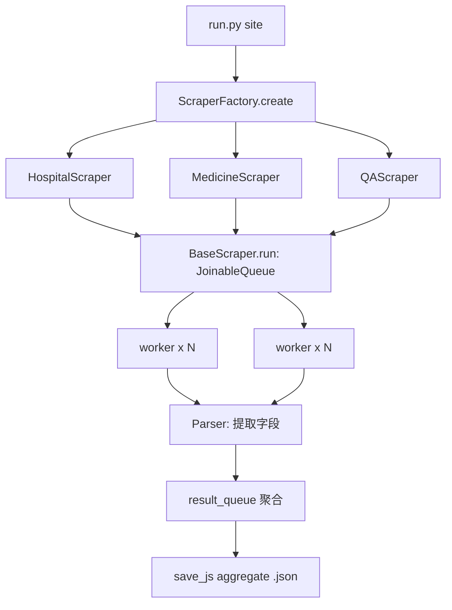

# 架构说明：Python 爬虫（工厂模式）

本文档说明重构后的 `scrapers/` 包设计。目标是消除三个爬虫
（医院 / 药品 / 医患问答）之间的大幅重复，同时保持单个类职责单一、可独立测试。

## 设计模式：工厂 + 策略(解析器)

- **工厂** `ScraperFactory.create(site)` 根据站点名返回一个具体的 Scraper。
- 每个 **Scraper** 是 `BaseScraper` 的子类，只负责「任务列表如何生成」。
- 具体的字段抽取委托给 **Parser**（解析器），由站点唯一绑定：
  `HospitalParser` / `MedicineParser` / `QAParser`。
- 新增一个站点时只需新增解析器并注册到 `SCRAPER_REGISTRY`，**无需**新增 Scraper 类。

```
ScraperFactory.create('hospital')
        │
        ▼
┌──────────────────────────────┐
│  HospitalScraper (BaseScraper)│
│  build_tasks() → (key, url)   │
└──────────────┬───────────────┘
               │ run()  多进程编排 (JoinableQueue)
               ▼
        _worker (模块级，可 pickle)
               │  parser.parse(soup, url, fetch, logger)
               ▼
        HospitalParser / MedicineParser / QAParser
```

## 多进程流水线（修复 `_thread.lock`）

1. `BaseScraper.run()` 用 `multiprocessing.JoinableQueue`（**不是**
   `queue.Queue`，后者内部含 `threading.Lock`，旧的 `hospital_info.py` 因此报
   `cannot pickle '_thread.lock'`）。
2. 工作函数 `_worker` 是模块级函数，只接收可序列化参数；解析器通过注册表
   **按名字**解析，`fetch` 默认为 `utils.get_soup`（模块级、可按引用 pickle）。
3. 每个 worker 自建 `Log`，不再跨进程传递 logger 实例。



## 组件职责

| 文件 | 职责 | 对外接口 |
| --- | --- | --- |
| `scrapers/base.py` | 共享流水线 + 多进程编排 | `BaseScraper`（抽象）`run() -> dict` |
| `scrapers/parsers.py` | 字段提取 | `BaseParser.parse(soup, url, fetch, logger)`，`PARSER_REGISTRY` |
| `scrapers/scrapers.py` | 三种具体 Scraper | `Hospital/Medicine/QAScraper` |
| `scrapers/factory.py` | 工厂 | `ScraperFactory.create(site)` |
| `scrapers/urls.py` | URL 构造 | `medicine_urls`, `qa_urls`, `get_link`... |
| `run.py` | CLI | `python run.py site [--processes N]` |

## 解析器接口

```python
class BaseParser(abc.ABC):
    name: str
    def parse(self, soup, url=None, fetch=None, logger=None): ...
```

- `soup`：当前页面的 `BeautifulSoup`。
- `url`：当前页面 URL（用于推导子页面，如科室介绍/门诊/医生）。
- `fetch(url) -> soup`：注入的抓取函数；生产环境默认 `utils.get_soup`，测试注入
  fixture 假抓取，使测试**离线**运行。
- 返回字典（或列表）记录；返回 falsy 表示本页无数据。

## 多进程编排

```python
python run.py medicine --processes 4 --count 100
```

聚合输出写到 `config.SAVE_FOLDERS[site]` 下的 `<site>.json`。